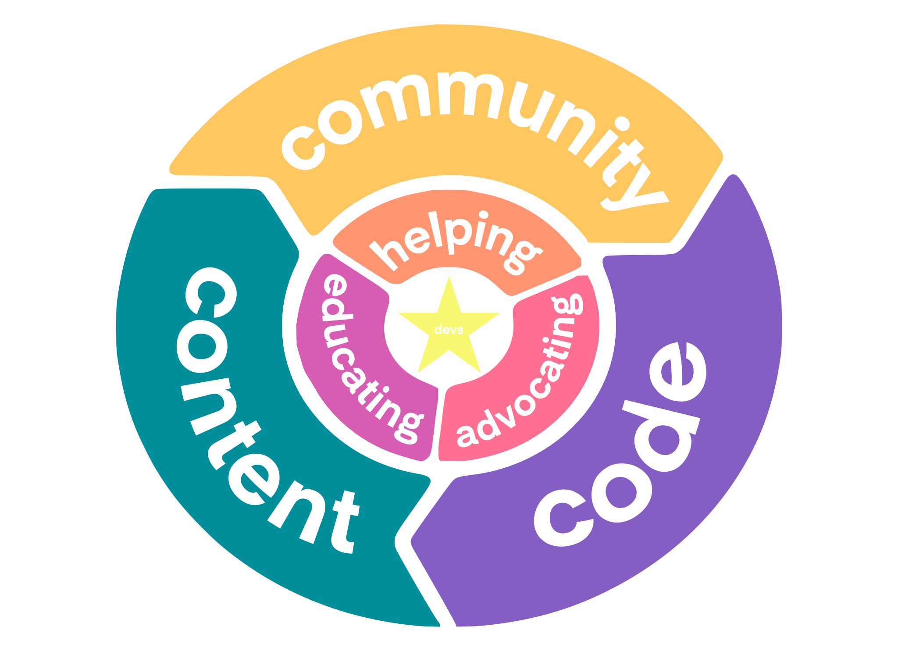

# Mindee's Developer Relations

  

This repository serves as a second brain for the Developer Relations (devrel) team at Mindee.

We will slowly add our processes, ideas, [tasks](https://github.com/mindee/devrel/issues) and everything needed to be successful with our community. It's a work-in-progress as we are starting to define the devrel framework, and it's always evolving. By doing so, we hope it will facilitate the start of the journey for the new members of our team, make us accountable, and being transparent to our beloved community of Mindee developers. We also believe other companies could benefit from our expertise and experience of doing developer relations.

As always, we value constructive feedback. Welcome home!

## Table of content

- [3rd party educational content](content/educational.md)
- [Communities](communities/README.md)
- [Developer Relations 3Cs](#the-3cs)
- [Developer Relations Mission](#our-mission)
- [Developer Relations Resources](resources/devrel.md)
- [Events](events/README.md)
- [Goals](goals/README.md)
- [Jobs/Roles Information](jobs/README.md)
- [Mindee in the Media](content/media.md)
- [Mindee Informations & Assets](resources/mindee.md)
- [Newsletter Archive](content/newsletter/README.md)
- [Onboarding](onboarding/onboarding.md)
- [Ownership](devrel/ownership.md)
- [Podcasts](content/podcasts.md)
- [Scripts](scripts/README.md)
- [SDKs](sdks/README.md)
- [Talks](content/talks.md)
- [Writing Guidelines](content/writing/README.md)

## Developer Relations at Mindee

### Our Mission
We help developers be successful by nurturing a healthy and welcoming community around the Mindee ecosystem. This means listening to, inspiring, educating, and supporting our community however we can.

### The 3Cs

The three pillars of Developer Relations are **C**ommunity, **C**ontent, and **C**ode, also known as the 3Cs*. The main focus of our team is the community: just read our mission to understand that everything we do is for our developer community. To help us achieve our mission, we use two main activities: content and code. The former is any type of content on any useful medium; some examples are talks at conferences, the developer documentation, or video tutorials. The latter, code, is part of the foundation of who we are: we are developers. It translates into code examples for the documentation, code demos for our conference presentations, technical support, demo applications, or even being responsible for specific APIs or contributing to open source to give back to the community and be a good web citizen. All together, they form the foundation of developer relations at Mindee.

\* _adapted from [SendGrid 2014 article](https://sendgrid.com/blog/3-cs-developer-relations/)_
