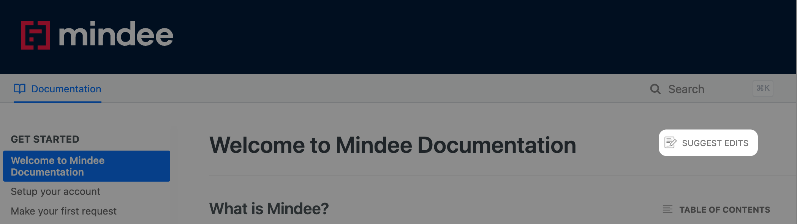
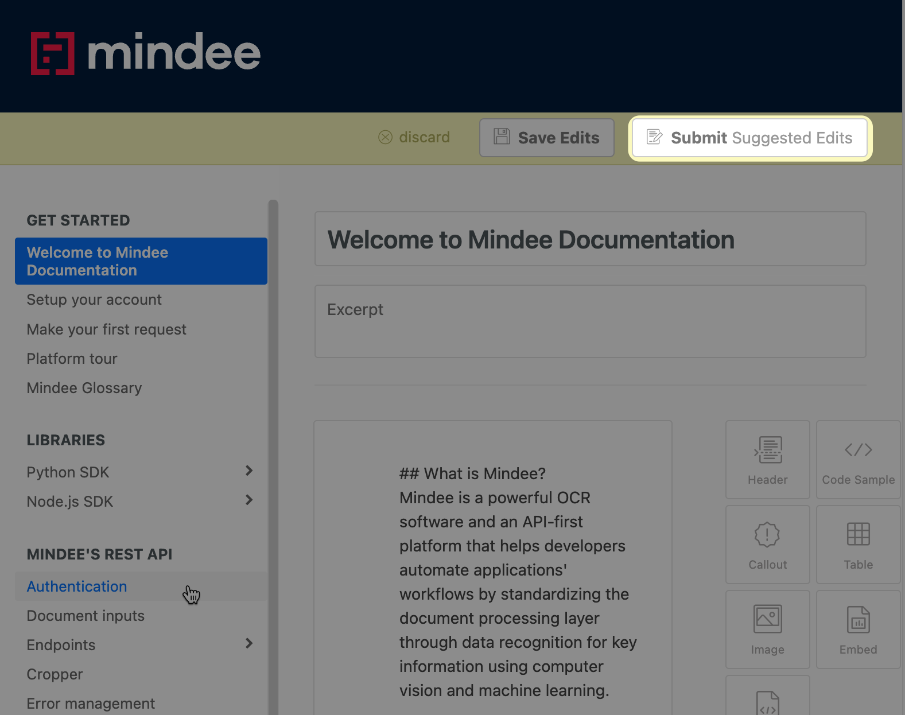
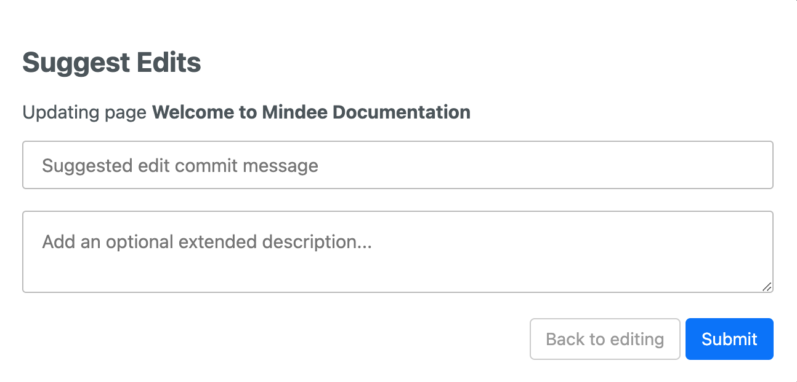
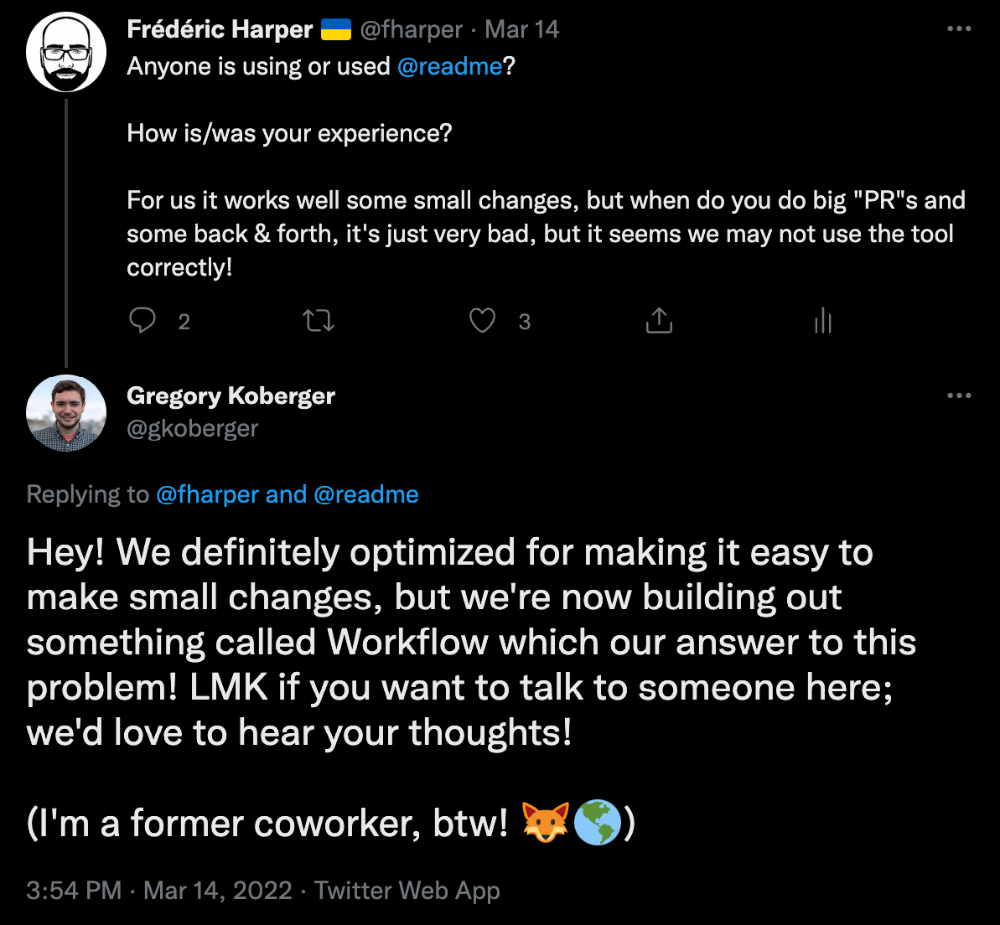

# Documentation

Here are some guidelines for writing the [Mindee documentation](https://developers.mindee.com/docs) using README.io. For anything Markdown specific, please follow the [Markdown guidelines](markdown.md).

- [Processes](#processes)
- [README.io Issues](#readmeio-issues--limitations)
- [Syntax](#syntax)
- [Templates](#templates)

## Processes

### Modification

If you want to modify the documentation yourself, you are welcome to do so by using the `Suggest Edits` option which is on all pages at the top right corner. You need to be connected to README.io to use this feature. If you do not have an README.io account, please ask [Fred](https://github.com/fharper), [Jonathan](https://github.com/jonathanMindee) or [Olivier](https://github.com/olivMindee).

Once you are done, you can save your modifications using the `Submit Suggested Edits` option which is on all pages at the top right corner. We suggest that you propose [small edits](#large-suggest-edits) for each of your `Suggest Edits`.

> 🚧 **Warning**
>
> Do not use the `Save Edits` button. **All modifications** needs to go through the [review process](#review).

You will be ask to add `Suggested edit commit message`: it is important to add a meaningful, but short description of your changes. If the change requiere more information, you can write more details in the `Add an optional extended description...` textbox. That information will be useful for the [review process](#review) and the documentation history.

Once it's done, the Developer Relations team will receive a notification, and will [review](#review) you edits suggestions as soon as possible.

### Review

All `Suggest Edits` are reviewed by [Favour](https://github.com/fakela) & [Fred](https://github.com/fharper) before being merged into the live documentation. In the case that [Favour](https://github.com/fakela) make a `Suggest Edits`, [Fred](https://github.com/fharper) will be the reviewer: the other way around if [Fred](https://github.com/fharper) make a `Suggest Edits`.

For smaller modifications during the review process, like formatting or typos, we will go ahead and do them. Anything else will be validated with the person who `Suggest Edits`.

### Suggestions

If you do not wish to `Suggest Edits` yourself and you have ideas for new content, modifications, or having any problems with the documentation, please create an issue in the [Developer Relations JIRA project](https://mindee.atlassian.net/jira/software/projects/DEVREL/issues/) with as much details as you can . If you don't have an JIRA account, ask [Emmanuelle](https://github.com/emmanuellethomas).

## README.io Issues & Limitations

### Categories
README.io has a bug where it's impossible to reorder a category outside of the current viewport, which makes it difficult for us since we have sections, like the one with the use cases that have a lot of pages. Fred was only able to do it with Safari on macOS.

### File Types
README.io only support images. If you need to add another type of file into the documentation, please let [Fred](https://github.com/fharper) knows: he will add it to our AWS S3 bucket, and will send you the link once it's done.

### Image Names
README.io add a UUID (Universally Unique IDentifier) to all images uploaded to their platform. It means that a file named `classification.png` will be automatically renamed `XXXXXXX-classification.png` like `c7c2d02-classification.png`. If it is something you need to avoir, please refer yourself to the [File Types](#file-types) section.

### Large Suggest Edits
Please refrain for making `Suggest Edits` that contains too many suggestions. If you do, there are chances that README.io will stop working, and prevent us to merge the changes or even to see them in some cases. README.io isn't built for that, as mentioned by the founder on Twitter. They are working on a solution that we think, should be closer to the GitHub PR Review experience.

### Redirection
README.io doesn't provide automatic redirection when page `slug` changes. If you do, you need to manually add a redirection rule in the [Error Page](https://dash.readme.com/project/mindee/v1.0/errors).

### Suggest Additionnal Edits
In the case of a back and forth between the person who suggested some documentation edit, and one of the reviewer, please limit these interactions to once or twice. If there are too many back and forth, README.io just stop working and prevent us from merging the changes. README.io isn't built for that: see previous tweet image.

### Unpublished Pages
Keep in mind that unpublishing a page from README.io only means that the page won't be displayed on the left sidebar table of content. Anyone with the URL will still be able to view it. You need to delete the page if you don't want anyone to access it.

## Syntax

### Code Block Syntax Highlight
We can only use the [languages supported by them](https://rdmd.readme.io/docs/code-blocks#language-support).

### Headers
Don't use `H1` headers as it's reserved for the page title.

## Templates

### Integrations

Below is a guide for creating an integration documentation

- Introduction to the integration
- Benefits (why do users need to use the integration) Optionally, this can be merged with the introduction if its not long
- Prerequisite(if any)
- How to install/Create account (Getting Started)
- Code demo (or how to use if no or low code)(add screenshots where needed)
- Troubleshoot/ Error management(if any)
- Resources/References
