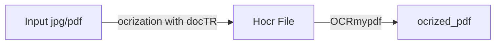

# PDF-OCRIZATION in 2 STEPS


<!-- # Summary

1) Motivate the use case for using ocrized pdf
    1) give examples of documents categories ( contract ...)
2) why using doctr 
        2) may be comparing with tesseract
3) how to produce ocrized pdf with doctr 
    4) lightweight ocrized pdf using ocrmypdf 
        5) do a comparison between the notebook way and ocrmypdf
4) how to search on a folder full of ocrized pdfs at once -->

<!-- [TOC] -->

<!-- ## Introduction -->
---
In this article we present a way to produce ocrized pdfs(*A pdf in which you can perform word searches*) out of images, scanned pdfs etc.
Below is a 2 step flow that we have adopted to accomplish the task.
1) At first we perform an ocr on the input image/scanned pdf using Mindee [doctr](https://mindee.github.io/doctr/). Later, convert the output to the Hocr file using xml export(inbuilt in docTR) of the ocr result. 

2) Then we convert the Hocr file to pdf using [OCRmypdf](https://ocrmypdf.readthedocs.io/en/latest/)



## Why would you want ocrized pdf ?

Scanned documents along with the images of documents need to be ocrized in order to be able to do searches on them. In this tutorial this can be done with few lines of code thereby allowing us to convert any image or an existing pdf into an ocrized pdf. With this being done, we will be able to search for any keywords within the document.

With the approach we present, we will be able to exhaustively ocrize the texts present embedded within the images which are normally left out(logos, watermarks ...) 

So creating an ocrized pdf would make it easy for "non developpers" to search for a specific keyword in various cases using their favourite pdf reader for example.

We will discuss in this tutorial two use cases, searching in a huge pdf or searching in a folder full of pdfs.

Below is a non exhaustive list of documents you may be interested by .

You may be dealing with a huge pdf like:
*   contracts (terms and conditions, loan contracts, employment contracts, etc )
*  specifications
*  scientific/technical reports
*  insurance policies 
*  request for information / request for quotation / request for proposals

Or may be you are dealing with a folder full of documents : 
* resumes (find a specific skill)
* questionnaires / forms (find a specific answer)
* invoices / receipts / quotations (find a specific item/customer/supplier )
* presentations (find any keyword)
* old scanned news articles (find a specific news)

## Why using docTR for ocrizing pdfs
### Quick catch-up with docTR

* [doctr](https://github.com/mindee/doctr) is one of the best open-source OCR solutions available. It uses state of the art detection and recognition models that can seamlessly process documents for Natural Language Understanding tasks. With just 3 lines of code we can load a document and extract text with a predictor! 

```gherkin=
pip install python-doctr

from doctr.io import DocumentFile
from doctr.models import ocr_predictor
======================================

model = ocr_predictor(pretrained=True)
# PDF
doc = DocumentFile.from_pdf("path/to/your/doc.pdf")
# Analyze
result = model(doc)
```
docTR offers pretrained backbones for both detection and recognition. For more information on the choices of available backbones please refer to the [documentation](https://mindee.github.io/doctr/using_doctr/using_models.html). Another major perk of using docTR over the existing open source packages is that not only can it be trained with small rotations but also there exists pre trained detection backbones such as ***dbresnet50rotation***. This makes docTR more robust for the ocrization tasks!
:::success
:exclamation:List of supported vocabs can be found [here](https://mindee.github.io/doctr/modules/datasets.html?highlight=character#supported-vocabs).
:::

### Performances


|                                   | Receipts |           | Invoices |           | IDs    |           |
|-----------------------------------|----------|-----------|----------|-----------|--------|-----------|
| Architecture                      | Recall   | Precision | Recall   | Precision | Recall | Precision |
| (**docTR**)db_resnet50 + master       |       **79** |     **81.42** |    65.57 |     69.86 |  51.34 |      52.9 |
| (**docTR**)db_resnet50 + sar_resnet31 |    78.94 |     81.37 |    65.89 |     **70.79** |  **51.78**|     **53.35** |
| **AWS textract**                      |    75.77 |      77.7 |    **70.47** |     69.13 |  46.39 |     43.32 |
| **Gvision doc. text detection**       |    68.91 |     59.89 |     63.2 |     52.85 |   43.7 |     29.21 |

> Due to the sensitive information contained in the dataset used for the comparision the dataset couldn't be made publicly available, however, below we have some comparison over public datasets.


|                                   | FUNSD  |           | CORD   |           |
|-----------------------------------|--------|-----------|--------|-----------|
| Architecture                      | Recall | Precision | Recall | Precision |
| (**docTR**)db_resnet50 + master       |  71.03 |     76.06 |  84.49 |     81.94 |
| (**docTR**)db_resnet50 + sar_resnet31 |  71.25 |     76.29 |   84.5 |     **81.96** |
| **AWS textract**                      |   **78.1** |        **83** |   87.5 |        66 |
| **Gvision doc. text detection**       |     64 |      53.3 |   68.9 |      61.1 |

> The above OCR models have been evaluated using both the training and evaluation sets of FUNSD and COORD. For further interest regarding the metrics being used are avalilable in [Task evaluation](https://mindee.github.io/doctr/modules/utils.html#metrics)

## Jumping to CodeBase!
With the few lines of codes below, we can produce lightweight ocrized pdfs with doctr and ocrmypdf.

For this sake, let's install mindee [doctr](https://mindee.github.io/doctr/) and [OCRmypdf](https://ocrmypdf.readthedocs.io/en/latest/)
```groovy=
# installing requirements
!pip install "python-doctr[tf]"
!pip install ocrmypdf
```


We can try this on any image / scanned pdf of your choice, for the sake of the demo, we chose the below image :
```groovy=
# sample input image
!wget https://pbs.twimg.com/media/B_UpX3WU8AA2j3r.jpg -O ./data/images/image.jpg
```
Below is our chosen image for the demo : 


Let's define output folders for the output pdf and the hOCR data related to the doctr ocr results .  
```groovy=
import os
# define output folder
output_folder = "./output/"
output_hocr_folder = output_folder + "hocr/"
output_pdf_folder = output_folder + "pdf/"

os.makedirs(output_hocr_folder,exist_ok=True)
os.makedirs(output_pdf_folder,exist_ok=True)
```

Now let's load the image (we could have used a scanned pdf instead, in that case use DocumentFile.from_pdf method) and run an ocr with doctr :
```groovy=
from doctr.models import ocr_predictor
from doctr.io import DocumentFile

# load image
image_path = "./data/images/image.jpg"

# extracting text from input image using docTR
docs = DocumentFile.from_images(image_path)

# load model
model = ocr_predictor(
            det_arch='db_resnet50',
            reco_arch='crnn_vgg16_bn', 
            pretrained=True
)

result = model(docs)

# display ocr boxes
result.show(docs)
```
Below image is the image highlighting detected text using  docTR ocr : 


Let's export docTR ocr results as an xml file with hOCR format :

```groovy=
# export xml file 
xml_outputs = result.export_as_xml()
with open(os.path.join(output_hocr_folder,"doctr_image_hocr.xml"),"w") as f :
    f.write(xml_outputs[0][0].decode())
```
After exporting the hOCR result of docTR as xml, we can use ocrmypdf to convert it to an ocrized pdf .
```groovy=
from ocrmypdf.hocrtransform import HocrTransform
output_pdf_path = output_pdf_folder + "hocr_output.pdf"

hocr = HocrTransform(
    hocr_filename=output_pdf_path,
    dpi=300
)

# step to obtain ocirized pdf
hocr.to_pdf(
    out_filename=output_pdf_path,
    image_filename=image_path,
    show_bounding_boxes=False,
    interword_spaces=False,
)
```
Voila! Now we have created our ocrized pdf as desired. 


## How to search on a folder with multiple ocrized pdfs
To search on a folder full of numeric or ocrized pdfs in ubuntu terminal for instance, you could use the ubuntu pdfgrep command.

Let's install pdfgrep first, 
```groovy=
# first let's install pdfgrep
sudo apt-get update
sudo apt-get install pdfgrep
```

Now we can use pdfgrep to search for any information using a keyword, we can do simple searches with exact match or using a regex for more flexibility .  

Below we will look for year information using keyword "Year" . 

```console
pdfgrep -r "Year" 

./hocr_output.pdf: APPLICANTS   ForPublication Year2015-2016

```

Now let's search for years from 2010 to 2019 in the document using a simple regex. 

```console
pdfgrep -r -P "\b201[0-9]\b" 

./hocr_output.pdf: APPLICANTS   ForPublication Year2015-2016
./hocr_output.pdf:andsubmittotheVarsitarianofficeonorbeforeMARCH:27,2015.
```

We now hereby demonstrated how easy it's to leverage the ocrized pdf search power on a folder using few line of commands .

## Why ocrmypdf!
OCRmyPDF is an application and library that adds text “layers” to images in PDFs, making scanned image PDFs searchable. It includes an image-oriented PDF optimizer which by default runs with safe settings with the goal of improving **compression** at no loss of quality. Optimizations only occur after OCR and only if OCR succeeded. [Optimization](https://ocrmypdf.readthedocs.io/en/latest/optimizer.html) ranges from ==-00== through ==-03==, where 0 disables optimization and 3 implements all options. Along with it, it comes with tons of other options such as *rotation correction*, *batch processing*, *selective ocrization* and so on!
This article helps overcome the major limitation of OCRmyPDF which is that it is limited by the Tesseract OCR engine. Therefore with Tesseract, it is not as accurate as state of the art OCR solutions. Poor quality scans could produce poor quality OCR. That is the reason we went with docTR as a replacement to the default ocr engine of OCRmypdf.

###### tags: `OCR` `docTR` `OCRmypdf`
